# PII models in Docker

This project contains PII models in Docker.

The project uses docker-compose to orchestrate the services for development environment.

In production, we use Kubernetes with Helm manifests.

## Terms

* Personally Identifiable Information (PII)
* Protected Health Information (PHI)
* Payment Card Industry (PCI)

## Architecture Ideas

### Other architecture ideas

* Architecture 1

* Architecture 2

